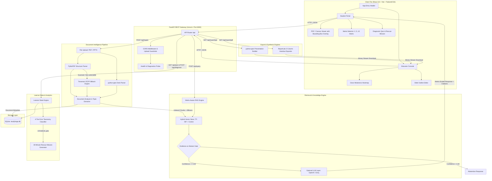

# 🎓 StudyForge OS: AI-Powered Adaptive Learning & Content Generation Platform

[](https://fastapi.tiangolo.com)
[](https://reactjs.org/)
[](https://vitejs.dev/)
[](https://tailwindcss.com/)
[](https://www.python.org/)
[](https://pymupdf.readthedocs.io/)
[](https://www.docker.com/)
[](https://www.sqlite.org/)
[](https://vercel.com/)
[](https://render.com/)

> **Smart India Hackathon (SIH 2026) Prototype**  
> Developed by **Team Tech_Warriors** — Unified Integration of **StudyCopilot & StudyForge**.

---

## 🌟 Executive Overview

**StudyForge OS** is an enterprise-grade, AI-powered adaptive learning operating system that converts static, unstructured curriculum materials (syllabi, lecture notes, textbook chapters, scanned PDFs, and PowerPoint slide decks) into **grounded, interactive learning instruments** for students and **automated pedagogical preparation engines** for educators.

Traditional learning tools suffer from three fundamental limitations:
1. **Uncalibrated AI Responses**: Generic LLMs fail to match university exam scoring rubrics (e.g., answering a 10-mark question with two sentences or a 2-mark question with three pages).
2. **Hallucination & Lack of Verifiable Evidence**: Answers often invent ungrounded explanations with no verifiable page-level textbook trace.
3. **High Educator Preparation Burden**: Manually converting syllabus documents into teaching presentations, structured handouts, and diagnostic mistake assessments takes hours.

**StudyForge OS solves this end-to-end** through coordinate-grounded retrieval-augmented generation (RAG), dynamic marks-aware answer scaling, active diagnostic micro-quizzes with cognitive error taxonomy, and one-click facilitator asset synthesis (PowerPoint decks and printable study guides).

---

## 🚀 Key System Capabilities

### 1. 📄 Structure-Aware Ingestion & PDF Highlight Offsets
- **Multi-Format Ingestion**: Ingests arbitrary digital PDFs, scanned notes, and modern PowerPoint presentations (`.pptx`).
- **Coordinate-Level Extraction**: Extracts page numbers, normalized bounding boxes (`[x0, y0, x1, y1]`), headings, and paragraph boundaries using PyMuPDF (`fitz`).
- **Localized OCR Fallback Engine**: Automatically detects non-selectable digital PDFs or low-resolution scans, dynamically routing them to an integrated Tesseract OCR pipeline while preserving coordinate geometries.
- **Ingestion Protection Gates**: Enforces a 25 MB upload limit, 100-page document cap, and 45-second execution budget with asynchronous thread-pool offloading.

### 2. 🎯 Marks-Aware Answer Scaling (2, 5, 10 Marks)
Calibrates response depth, structure, and formatting strictly to Indian higher education (B.Tech / University) exam standards:
- **2-Mark Schema (Definition Scale)**: 1–2 sentence precise technical definition + 1 concise real-world/code example (<50 words).
- **5-Mark Schema (Concept Scale)**: Structured paragraph definition + 3–4 bulleted core principles + process or code example.
- **10-Mark Schema (Comprehensive Scale)**: Abstract definition + architectural advantages + detailed step-by-step algorithm + ASCII/structural block diagrams + evaluation conclusion.

### 3. 🛡️ Strict Grounding & Evidence-or-Abstain Gate
- **Zero-Hallucination Guardrail**: Evaluates cosine similarity between the query and retrieved context chunks against a strict threshold ($\ge 0.40$).
- **Deterministic Abstention**: If the query is off-topic (e.g., cooking, pop culture) or unsupported by the uploaded document, the system strictly abstains:
  > *"The requested query is not supported by verified textbook evidence."*
- **Cross-Document Isolation**: Strict `document_id` scoping in vector memory guarantees that queries only retrieve context from the currently active document.

### 4. 🖥️ Interactive Student Portal
- **Split-Screen Workspace**: Resizable dual-pane workspace with an interactive chat assistant on the left and a live document viewer on the right.
- **Focus Mode Toggles**: Seamlessly switch between **Split Screen**, **Chat Focus**, and **Document Focus** layouts.
- **Real-Time Canvas/SVG Highlight Overlay**: Clicking any citation badge automatically scrolls the document viewer to the exact source page and displays an animated, pulsing orange bounding-box highlight over the cited paragraph.

### 5. 🧬 Diagnostic Error Taxonomy & Learning Twin
- **Micro-Quiz Engine**: Automatically generates formative diagnostic quiz questions scoped to the active document's key concepts.
- **Cognitive Error Taxonomy**: Evaluates incorrect student choices against four distinct cognitive error categories:
  1. `conceptual_gap`: Misunderstanding of foundational principles or invariants.
  2. `process_mistake`: Step omissions, arithmetic slips, or execution sequencing errors.
  3. `terminology_confusion`: Conflation of related domain terms or definitions.
  4. `careless_error`: Superficial misreading or boundary oversight.
- **🚨 30-Minute Rescue Mission**: Automatically triggered whenever a `conceptual_gap` is diagnosed. Provides an immediate real-world analogy (e.g., company hierarchy analogy for BST node replacement), an action remediation plan, and a prerequisite retest question before advancing.
- **Readiness Telemetry**: Real-time tracking of learner readiness scores (0–100%) and historical mistake patterns stored persistently.

### 6. 👨‍🏫 Educator Console & Facilitator Asset Synthesis
- **Document Intelligence Hub**: Automatically extracts document title, executive summary, sections, key concepts, and high-yield examination portions.
- **Interactive Slide Outline Editor**: Review, edit, and organize generated lecture slides with titles, bullet points, and speaker teaching notes.
- **Editable PowerPoint Generator (`python-pptx`)**: Generates 10-slide formatted `.pptx` presentation decks with speaker notes for university lectures.
- **Printable Study Guide Compiler (`ReportLab`)**: Compiles professional, print-ready double-column study guide handouts with course metadata, definitions, algorithms, and 2/5/10-mark sample questions.
- **Class Weakness Heatmap & Concept Mastery Widget**: Visualizes class-wide topic mastery (Green = Mastered, Yellow = Moderate, Red = Critical Gap) and mistake distributions.

### 7. 💾 Hybrid Storage & Isolated Clean State
- **SQLite Database Persistence**: Backed by `studyforge.db` storing documents, chunks, learner states, quiz submissions, and verified question banks.
- **Clean Production Mode**: Ingested production sessions initialize completely clean with zero hardcoded sample data.
- **Isolated Demo Sandbox**: Pre-configured Binary Search Tree (BST) curriculum available on-demand via the `/api/demo/load` endpoint for demonstrations.

---

## 🏗️ System Architecture



---

## 💻 Tech Stack

| Layer | Technologies | Key Libraries & Tools |
|---|---|---|
| **Frontend UI** | React 18, Vite 5, JavaScript (ESM) | `tailwindcss`, `lucide-react`, PostCSS, HTML5 Canvas |
| **Backend API** | Python 3.11+, FastAPI, Uvicorn | `pydantic v2`, `python-multipart`, `asyncio` |
| **Document Intelligence** | PyMuPDF (`fitz`), python-pptx, Tesseract OCR | `tesseract-ocr`, `tesseract-ocr-eng`, `UB-Mannheim` |
| **RAG & Vector Retrieval**| Scikit-learn TF-IDF, NumPy, Cosine Similarity | Custom Coordinate Vector Store Manager |
| **Generators & Synthesis**| `python-pptx`, `ReportLab` | OpenXML PresentationML, PDF Canvas Flowables |
| **Database & Persistence**| SQLite 3, Python `sqlite3` | `studyforge.db` (Documents, Chunks, Learner State, Quiz) |
| **DevOps & Containers** | Docker, Vercel, Render, Railway | Multi-stage Dockerfile, `render.yaml`, `vercel.json` |

---

## 📂 Project Directory Structure

```
StudyForge-OS/
├── backend/                        # FastAPI Backend Application
│   ├── app/
│   │   ├── api/
│   │   │   └── routes.py           # REST endpoints: /ingest, /query, /quiz, /export, etc.
│   │   ├── demo/
│   │   │   └── demo_data.py        # Isolated BST curriculum dataset for live demos
│   │   ├── diagnostics/
│   │   │   └── learner_state.py    # Error taxonomy classifier & rescue mission logic
│   │   ├── generators/
│   │   │   ├── pdf_generator.py    # ReportLab 2-column study guide handout exporter
│   │   │   └── ppt_generator.py    # python-pptx editable lecture slide deck generator
│   │   ├── ingestion/
│   │   │   ├── document_analyzer.py# Structural document analyzer & concept extractor
│   │   │   ├── ocr.py              # Tesseract OCR engine fallback & runtime verifier
│   │   │   ├── pdf_parser.py       # PyMuPDF coordinate & bounding-box text extractor
│   │   │   └── pptx_parser.py      # python-pptx presentation parser
│   │   ├── rag/
│   │   │   ├── qa_engine.py        # Marks-aware prompt matrix & evidence-or-abstain gate
│   │   │   └── vector_store.py     # TF-IDF semantic vector store with document isolation
│   │   ├── schemas/
│   │   │   └── api_schemas.py      # Pydantic request/response validation schemas
│   │   ├── storage/
│   │   │   └── database.py         # SQLite persistence layer (studyforge.db)
│   │   └── main.py                 # FastAPI application gateway, CORS & entry point
│   ├── tests/                      # Comprehensive backend test suite (10 test files)
│   │   ├── test_api_gateway.py
│   │   ├── test_dynamic_exports.py
│   │   ├── test_issue_16_pipeline.py
│   │   ├── test_pdf_parser.py
│   │   ├── test_rag.py
│   │   └── ...
│   ├── .env.example                # Backend environment configuration template
│   ├── requirements.txt            # Python dependencies
│   └── run_backend.bat             # Backend launch script (Windows)
├── frontend/                       # React 18 + Vite Frontend Application
│   ├── src/
│   │   ├── components/
│   │   │   ├── common/
│   │   │   │   └── Header.jsx      # Top navigation, status indicator & tab switcher
│   │   │   ├── educator/
│   │   │   │   ├── EducatorConsole.jsx  # Ingestion hub, outline editor & export actions
│   │   │   │   └── WeaknessHeatmap.jsx  # Topic mastery heatmap & error distribution
│   │   │   └── student/
│   │   │       ├── DiagnosticQuiz.jsx   # Micro-quiz engine & rescue mission modal
│   │   │       ├── MarksSelector.jsx    # 2, 5, 10 marks rubric selector
│   │   │       ├── PdfViewer.jsx        # SVG/Canvas PDF viewer with bounding box highlights
│   │   │       └── StudentPortal.jsx    # Split-screen chat workspace & document upload
│   │   ├── config/
│   │   │   └── api.js              # Centralized API client & environment base URL router
│   │   ├── App.jsx                 # Root layout container
│   │   ├── index.css               # Tailwind CSS rules & custom scrollbar styles
│   │   └── main.jsx                # React DOM entry point
│   ├── tests/                      # Frontend automated test suite
│   ├── package.json                # Frontend dependencies & npm scripts
│   ├── tailwind.config.js          # Tailwind CSS design system tokens
│   ├── vite.config.js              # Vite server & API proxy configuration
│   └── run_frontend.bat            # Frontend launch script (Windows)
├── Dockerfile                      # Production Docker container (FastAPI + Tesseract OCR)
├── render.yaml                     # Render 1-click cloud deployment blueprint
├── railway.json                    # Railway deployment specification
├── vercel.json                     # Vercel SPA deployment & backend reverse proxy rewrites
├── start_all.bat                   # 1-Click launcher for both Backend and Frontend
├── TEAM_ROLES.md                   # Team role allocation & shared API contracts
├── ISSUES_BACKLOG.md               # 21-issue technical backlog & acceptance criteria
└── README.md                       # Master project documentation
```

---

## 📡 REST API Reference & Data Contracts

All endpoints are prefixed with `/api` and documented interactively via Swagger UI at `/docs`.

### 1. Gateway & Health

| Method | Endpoint | Description |
|---|---|---|
| `GET` | `/` | Root discovery URL and welcome message |
| `GET` | `/health` | Gateway health check returning engine status and version |
| `GET` | `/api/health` | Deep health check probe reporting PyMuPDF, OCR, PPTX, ReportLab, and SQLite statuses |

### 2. Document Ingestion & Management

| Method | Endpoint | Description |
|---|---|---|
| `POST` | `/api/ingest` | Ingests a PDF or PPTX file, extracts coordinates, indexes vectors, and runs document analysis |
| `GET` | `/api/documents` | Returns all available indexed documents with page and chunk counts |
| `GET` | `/api/document/{id}` | Retrieves document analysis, summary, sections, key concepts, and slide outline |
| `GET` | `/api/document/{id}/pdf` | Streams uploaded binary PDF bytes for in-browser PDF rendering |
| `POST` | `/api/demo/load` | Loads the isolated Binary Search Tree (BST) curriculum dataset on demand |

### 3. Marks-Aware RAG Engine

| Method | Endpoint | Request Body | Response Description |
|---|---|---|---|
| `POST` | `/api/query` | `{ "question": str, "marks": int, "document_id": str }` | Grounded answer scaled to marks, confidence score, citation with bounding box, or abstention |

#### Example Query Request
```json
{
  "question": "Explain Binary Search Tree deletion algorithm",
  "marks": 10,
  "document_id": "doc_a1b2c3d4"
}
```

#### Grounded Success Response
```json
{
  "status": "success",
  "question": "Explain Binary Search Tree deletion algorithm",
  "marks": 10,
  "answer": "### 10-MARK ANSWER (Comprehensive Scale)\n\n#### 1. Abstract Definition & Invariant\nBinary Search Tree (BST) deletion removes a key while maintaining the BST invariant...",
  "confidence_score": 0.94,
  "abstain": false,
  "citation": {
    "document_name": "Data_Structures_Chapter_4.pdf",
    "page_number": 3,
    "snippet": "Case 3 (Two Children): Replace node value with its in-order successor and recursively delete successor.",
    "bounding_box": [50.0, 120.0, 520.0, 260.0]
  }
}
```

#### Evidence-or-Abstain Response (Off-Topic or Unsupported)
```json
{
  "status": "abstain",
  "question": "How do you bake a chocolate cake?",
  "marks": 2,
  "answer": "The requested query is not supported by verified textbook evidence.",
  "confidence_score": 0.08,
  "abstain": true,
  "citation": null
}
```

### 4. Diagnostic Assessment & Learner State

| Method | Endpoint | Description |
|---|---|---|
| `GET` | `/api/quiz?document_id={id}` | Fetches a diagnostic micro-quiz question dynamically scoped to the target document |
| `POST` | `/api/diagnose` | Evaluates student answer against the 4-tier error taxonomy and triggers rescue missions |
| `GET` | `/api/readiness` | Returns class readiness scores, topic mastery heatmap items, and mistake distribution |

#### Example Diagnostic Submission
```json
{
  "question_id": "q_doc_a1b2_01",
  "selected_option": 1,
  "correct_option": 0,
  "topic_id": "bst_deletion"
}
```

#### Diagnostic Response with Rescue Mission
```json
{
  "status": "diagnosed",
  "is_correct": false,
  "error_category": "conceptual_gap",
  "error_title": "Conceptual Gap: In-Order Successor Substitution",
  "explanation": "You confused node deletion with simple leaf removal.",
  "updated_readiness": 65,
  "rescue_mission_triggered": true,
  "rescue_mission": {
    "title": "🚨 30-Minute Rescue Mission: BST Node Swapping Analogy",
    "analogy": "Think of deleting a node with two children like replacing a CEO: you promote the lowest-ranking executive who is still qualified (the in-order successor) to keep the hierarchy intact.",
    "action_plan": "Review traversal rules before re-attempting the deletion quiz.",
    "prerequisite_retest_question": "Which node replaces a deleted node with two children?"
  }
}
```

### 5. Facilitator Asset Exports

| Method | Endpoint | Query Parameter | Response Content |
|---|---|---|---|
| `GET` | `/api/export/ppt` | `document_id={id}` | Downloads editable presentation deck (`.pptx`) with speaker notes |
| `GET` | `/api/export/pdf` | `document_id={id}` | Downloads print-ready double-column study guide handout (`.pdf`) |

---

## ⚡ Quick Start Guide

### Prerequisites
- **Python**: Version `3.11` or higher
- **Node.js**: Version `18.0` or higher (with `npm`)
- **Tesseract OCR** *(Optional, recommended for scanned/image-only PDFs)*:
  - **Windows**: Install via UB-Mannheim installer or `winget install UB-Mannheim.TesseractOCR`
  - **Linux (Ubuntu/Debian)**: `sudo apt update && sudo apt install -y tesseract-ocr tesseract-ocr-eng`
  - **macOS**: `brew install tesseract tesseract-lang`

> **Note**: Digital PDFs with selectable text layers parse natively using PyMuPDF without requiring Tesseract.

---

### 1. Launch Everything (Windows 1-Click)
Run the automated batch script from the root directory:
```cmd
start_all.bat
```
This automatically launches:
- **FastAPI Backend** on [http://localhost:8000](http://localhost:8000) (API Docs: [http://localhost:8000/docs](http://localhost:8000/docs))
- **Vite React Frontend** on [http://localhost:5173](http://localhost:5173)

---

### 2. Manual Installation & Startup

#### A. Backend Setup
```bash
# Navigate to backend directory
cd backend

# Create and activate Python virtual environment
python -m venv venv

# Windows:
.\venv\Scripts\activate
# Linux / macOS:
source venv/bin/activate

# Install dependencies
pip install -r requirements.txt

# Start FastAPI development server with hot reload
uvicorn app.main:app --reload --host 0.0.0.0 --port 8000
```

#### B. Frontend Setup
```bash
# In a separate terminal, navigate to frontend directory
cd frontend

# Install Node dependencies
npm install

# Start Vite development server
npm run dev
```
Open your browser at `http://localhost:5173`.

---

## ⚙️ Environment Configuration

### Backend (`backend/.env`)
Copy the template from `backend/.env.example`:
```env
# Server Port
PORT=8000

# Environment mode: development | production
ENVIRONMENT=development

# Allowed CORS Origins (comma-separated URLs)
CORS_ORIGINS=http://localhost:5173,http://127.0.0.1:5173,https://sih-project.vercel.app

# Regular Expression for dynamic Vercel deployments
CORS_ORIGIN_REGEX=^https:\/\/.*\.vercel\.app$

# Optional LLM Configuration (OpenAI / Groq / Anthropic)
# If omitted, deterministic template-grounded RAG is used
OPENAI_API_KEY=
LLM_MODEL=gpt-4o-mini
LLM_API_BASE=https://api.openai.com/v1

# Optional explicit Tesseract OCR data directory path
# TESSDATA_PREFIX=/usr/share/tesseract-ocr/5/tessdata
```

### Frontend (`frontend/.env`)
Copy the template from `frontend/.env.example`:
```env
# Optional Backend API base URL override
# Leave empty for local development to use Vite's internal proxy
# Set to your deployed production backend URL in Vercel:
VITE_API_BASE_URL=
```

---

## 🧪 Testing & Quality Assurance

The codebase includes an extensive suite of automated tests across backend and frontend layers:

### Run Backend Tests
```bash
cd backend
python -m unittest discover -s tests -p "test_*.py" -v
```

**Backend Test Coverage Includes:**
- `test_api_gateway.py`: REST API routing, CORS preflights, and Pydantic schema validation.
- `test_pdf_parser.py`: PyMuPDF layout cleaning, bounding box offsets, and multi-column ordering.
- `test_rag.py`: 2/5/10 marks prompt formatting and evidence-or-abstain gate thresholds.
- `test_student_rag_upload.py`: Dynamic document scoping and multi-document isolation.
- `test_issue_16_pipeline.py`: End-to-end PDF upload $\rightarrow$ analysis $\rightarrow$ vector index $\rightarrow$ PPT/PDF exports.
- `test_upload_pipeline.py`: Upload validation, corrupt PDF rejection, and 25 MB / 100-page guardrails.
- `test_dynamic_exports.py`: Dynamic PowerPoint (`.pptx`) and ReportLab (`.pdf`) output integrity.
- `test_issue_47_bst_isolation.py`: Verifies zero hardcoded sample data leaks in production mode.
- `test_production_deployment.py`: Production configuration, healthcheck responses, and environment variables.

### Run Frontend Tests
```bash
cd frontend
npm test
```

---

## 🚢 Production Deployment

### 1. Backend Deployment (Docker / Render / Railway)

The repository includes a production-ready `Dockerfile` based on `python:3.11-slim` with native Tesseract OCR and graphics libraries installed:

```bash
# Build Docker image
docker build -t studyforge-backend:latest .

# Run Docker container
docker run -d -p 8000:8000 --name studyforge-api studyforge-backend:latest
```

- **Render**: Connect the repository to [Render](https://render.com) using the included `render.yaml` blueprint. It provisions a Docker web service with health check monitoring at `/api/health`.
- **Railway**: Connect the repository using the included `railway.json`.

### 2. Frontend Deployment (Vercel)

The frontend is configured for deployment on [Vercel](https://vercel.com) via `vercel.json`:
1. Import the repository on Vercel.
2. Set Root Directory to `./` (or `frontend`).
3. Set the Environment Variable:
   ```
   VITE_API_BASE_URL=https://your-backend-service.onrender.com
   ```
4. Deploy! The included `vercel.json` automatically proxies `/api/*` requests to your deployed backend while handling client-side SPA routing.

---

## 👥 Team Tech_Warriors (SIH 2026)

| Team Member | Role | Primary Technical Scope |
|---|---|---|
| **Divyay** | **RAG & Integration Lead** | Prompt matrix for 2/5/10 marks, vector DB schema, evidence-or-abstain security gate, end-to-end RAG pipeline |
| **Deepanshu** | **Document Intelligence Specialist** | PyMuPDF coordinate & bounding-box extractor, layout cleaner, Tesseract OCR fallback engine |
| **Yatharth** | **Lead Systems Backend Architect** | FastAPI async REST gateway, SQLite database layer, error taxonomy classifier, learner state telemetry |
| **Dev** | **Student Portal Developer** | React split-screen chat interface, marks selector UI, dynamic SVG/Canvas PDF bounding-box highlight renderer |
| **Ayush** | **Educator Console Developer** | Educator upload hub, live slide outline editor, class weakness heatmap widgets |
| **Priya** | **Output & QA Engineer** | `python-pptx` lecture deck generator, `ReportLab` 2-column study guide compiler, automated test suites |

---

## 📄 License & Acknowledgments

This project is developed for the **Smart India Hackathon (SIH 2026)** under the MIT License.  
Built with open-source technologies including [FastAPI](https://fastapi.tiangolo.com/), [React](https://reactjs.org/), [PyMuPDF](https://pymupdf.readthedocs.io/), [Tesseract OCR](https://github.com/tesseract-ocr/tesseract), [python-pptx](https://python-pptx.readthedocs.io/), and [ReportLab](https://www.reportlab.com/).